## 👋 Bem-vindo(a) ao meu perfil! 😁

### Sobre mim:

Estou me aprofundando no mundo do **Golang**, uma linguagem que me fascina e **Python** por conta do trabalho, apesar de ainda estar aprendendo, já tem me proporcionado uma grande evolução na minha carreira

---

  
  

---

### 🚀 Minhas Redes 

   
  
  

---

###  👢🐍 

<picture>
  <source media="(prefers-color-scheme: dark)" srcset="dist/github-snake-dark.svg" />
  <source media="(prefers-color-scheme: light)" srcset="dist/github-snake.svg" />
  
</picture>

---
